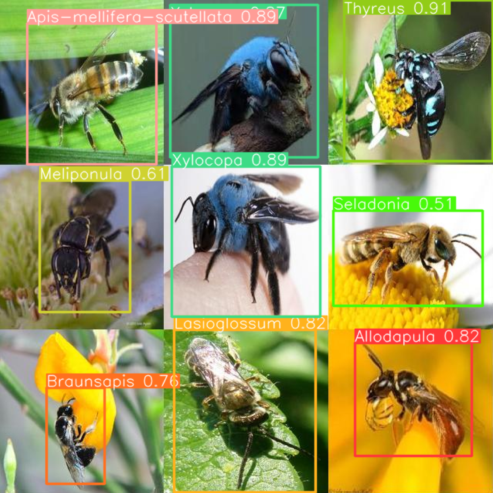

# Bee-Vision

## What this repo does

This repo is used for the identification and classification of different bee species from images.
It can classify bees into the following species from an image:

* *Allodapula*
* *Apis-mellifera-scutellata*
* *Braunsapis*
* *Lasioglossum*
* *Meliponula*
* *Seladonia*
* *Thyreus*
* *Xylocopa*

### Bee-Vision in action




### **Developed by**
- Hanno Jacobs - u17000042@tuks.co.za
- Yasekwa Dutywa - u23825848@tuks.co.za


---------
---------

## Usage

### Install python 3.10

```sh
sudo apt update && sudo apt upgrade -y && sudo apt-get install libgl1-mesa-glx libegl1-mesa libxrandr2 libxrandr2 libxss1 libxcursor1 libxcomposite1 libasound2 libxi6 libxtst6 && sudo apt install software-properties-common -y && sudo add-apt-repository ppa:deadsnakes/ppa && sudo apt install python3.10 && sudo apt-get install python3.10 python3.10-venv python3-pip && python3.10 --version
```

### Create a virtual environment

Create the virtual environment and then install the requirements

```sh
python3.10 -m venv .venv && source .venv/bin/activate && python3 -m pip install -U -r requirements.txt
```

If any of the above requirements fail to install and you just want to visualise the model you can run this command only and it should work

```sh
python3 -m pip install matplotlib streamlit tensorflow pillow ultralytics opencv-python
```

--------------------------
--------------------------

## Using the Streamlit inferencing tool

To use the model to inference on any bees image that you want run this command. It will open your browser window with the app ready for you to drop an image to infer on.

```sh
source .venv/bin/activate && .venv/bin/streamlit run visualization/visualise_inference.py
```

## Using the Streamlit augmentation visualisation tool

To look at what the different augmentation parameters do run this command. It will open your browser with the app ready for you to test the augmentation settings

```sh
source .venv/bin/activate && .venv/bin/streamlit run visualization/visualise_augmentation.py
```

--------------------------
--------------------------
